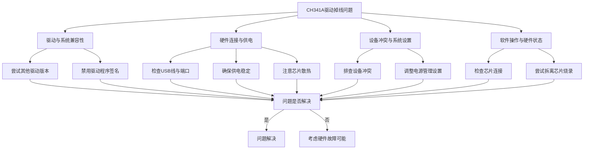
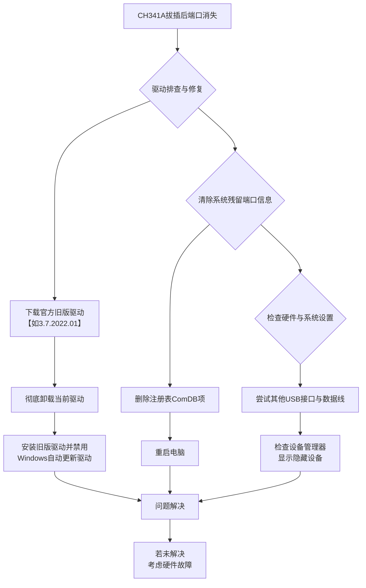

CH341A驱动在使用过程中出现掉线确实挺让人头疼的。为了帮助你系统地排查和解决这个问题，我整理了一个详细的排查流程图，你可以跟着步骤一步步检查：

下面我们来详细解读一下图中的各个步骤：

### 🔧 驱动与系统兼容性

驱动问题是导致CH341A不稳定的常见原因。

- **尝试其他驱动版本**：你正在使用的**3.5版驱动**虽然被一些用户反馈在Win10/Win11下可解决某些兼容性问题，但这个版本**可能并不适合你的特定环境**。建议：
  - 可以尝试在设备管理器中**完全卸载当前驱动**并换用**不同版本**的官方驱动。
  - 关注驱动日期，并非最新就是最好。有时**稍旧（但非过旧）的稳定版本**或**更新的官方测试版**可能有惊喜。
  - 务必从**芯片厂商官网**或**可靠的设备供应商**处获取驱动。

- **禁用驱动程序签名强制**：在某些Windows系统（尤其是Win10/Win11）上，**驱动程序签名强制**可能导致未正确签名的驱动加载失败或工作异常。可以尝试在系统**启动设置**中**禁用驱动程序强制签名**后再测试。

### 🔌 硬件连接与供电

很多情况下，问题出在硬件连接和供电上。

- **检查USB线与端口**：
  - **USB线材**务必使用**数据线**而非仅能充电的线缆。
  - 尝试将CH341A设备插入电脑机箱后部的**USB 2.0端口**。一些用户反馈**USB 3.0接口**可能对CH341A通信产生干扰。
  - 检查USB端口是否存在**接触不良**。

- **确保供电稳定**：
  - **供电不足**是导致掉线的典型原因之一。避免使用过长的USB线或经过多个转接的扩展坞。
  - 当使用CH341A对主板上的BIOS芯片进行**烧录/读取**时，有维修人员发现，**被操作的主板可能需要通电**（注意不是开机，通常是待机状态），否则编程器可能因功率不足掉驱动。
  - 如果通过测试夹连接未拆下的芯片，主板电路上的其他元件可能**增加CH341A的负载**，导致供电不稳或通信失败。最稳妥的方式是**将芯片从主板上拆下**再放到编程座上进行操作。

- **注意芯片散热**：CH341A芯片**工作时发热量可能较大**，特别是长时间读写操作时。芯片**过热可能导致设备断开连接**。可以触摸检查芯片温度，必要时改善通风环境或尝试缩短单次连续操作时间。

### ⚙️ 设备冲突与系统设置

- **排查设备冲突**：如果电脑上连接了多个串口设备或不同版本的CH341设备，可能产生冲突。建议**先仅连接一个CH341A设备**进行测试。

- **调整电源管理设置**：
  - 在Windows设备管理器中，找到对应的CH341A串口设备，在其**属性**的**电源管理**选项卡中，取消勾选 **“允许计算机关闭此设备以节约电源”** 。这可以防止系统在认为设备空闲时错误地暂停其供电。

### 💻 软件操作与硬件状态

- **确保芯片连接可靠**：如果使用测试夹子连接芯片，务必确保**每个触点都接触良好**。接触不良会导致通信中断和掉线。对于贴片芯片，有用户提到将芯片的VCC引脚挑起隔离（或使用特定方法避免主板电路影响）再进行烧录可能成功。

- **考虑编程器硬件故障**：如果以上所有方法均已尝试但问题依旧，特别是设备在**使用过程中异常发烫**，那么CH341A编程器本身存在**硬件故障**的可能性较高。

希望这些步骤能帮你找到问题所在。如果排查后情况依旧，或者你在某个步骤中遇到了更具体的现象，欢迎随时补充信息，我们再一起分析。

---
你遇到的CH341A USB转串口设备在重新拔插后必须重启电脑才能识别的问题，通常与驱动兼容性或系统对端口的错误管理有关。下面我为你梳理了详细的排查步骤和解决方案。

为了让你能更清晰地理解和解决这个问题，我整理了以下的排查流程图，你可以根据它逐步操作：

### 🔧 驱动排查与修复

这是最常见的问题根源，特别是驱动版本或兼容性问题。

1.  **尝试使用旧版驱动**：最新的CH341驱动（如3.9.2024.9版本）被报告存在稳定性问题，可能导致设备掉线。建议你尝试**降级**到更稳定的旧版本驱动（例如版本号3.7.2022.01）。
2.  **彻底重装驱动**：
    *   在设备管理器中原有驱动上**右键卸载设备**，并勾选“删除此设备的驱动程序软件”。
    *   从**官方渠道**下载旧版驱动。
    *   安装时，右键点击安装程序，选择“**以管理员身份运行**”。
    *   安装完成后**重启电脑**。
3.  **禁用驱动自动更新**：为防止Windows Update自动将驱动更新到有问题的版本，你可以在组策略编辑器或系统高级设置中，暂时**禁用Windows的自动驱动更新**功能。

### 🗂️ 清除系统残留端口信息

系统注册表记录的混乱端口占用信息也会导致此问题。

1.  **清除注册表端口记录**：这个方法可以让系统重新构建COM端口列表，清除端口的错误占用状态。
    *   **注意**：修改注册表前，建议备份。
    *   按 `Win + R` 键，输入 `regedit` 并回车。
    *   导航至以下路径：`HKEY_LOCAL_MACHINE\SYSTEM\CurrentControlSet\Control\COM Name Arbiter`。
    *   在右侧找到 `ComDB` 项，**删除**它。
    *   **关闭注册表编辑器并重启电脑**。系统重启后会自动重建此文件，端口占用状态会被重置。

### 🔌 检查硬件与系统设置

1.  **检查硬件连接**：
    *   尝试更换不同的**USB接口**，优先使用主板原生的USB 2.0接口，避免使用扩展坞或前置接口。
    *   确认你使用的USB线是**数据线**而非仅能充电的电源线。
2.  **在设备管理器中显示隐藏设备**：有时设备被系统禁用或隐藏了。
    *   打开设备管理器，点击“查看”菜单，选择“**显示隐藏的设备**”。
    *   检查“端口（COM和LPT）”列表下是否有呈现**灰色**的CH341设备，如果有，可以尝试右键点击将其**启用**。

### 💎 总结

总而言之，遇到CH341A设备拔插后掉线的问题，你可以按照以上流程进行排查，**优先尝试使用旧版驱动和清除注册表端口信息**这两种方法，它们解决了大多数用户的问题。

希望这些步骤能帮助你解决问题！如果尝试后仍有疑问，欢迎随时再来提问。