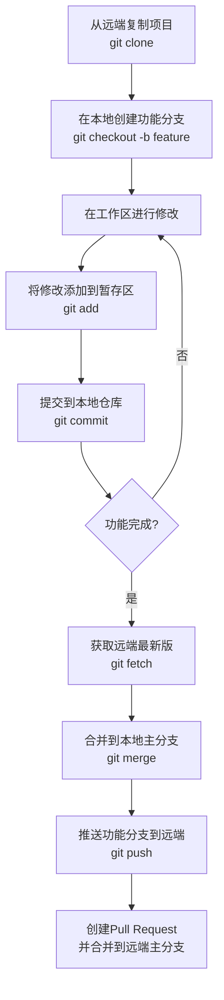

别担心，刚接触 Git 时感到混乱是非常正常的！它引入的概念确实和传统的文件保存方式很不一样。我会用一个清晰的流程和比喻帮你彻底搞懂。

### 核心概念一句话解读

*   **本地 (Local):** 你自己的电脑。你所有的操作都是在这里完成的。
*   **仓库 (Repository):** 一个被 Git 管理的项目文件夹。里面藏着 Git 用来记录文件历史的 `.git` 目录。
*   **分支 (Branch):** 一条独立的时间线。你可以在主时间线（`main` 或 `master`）上工作，也可以开一条新的时间线（例如 `feature/login`）去尝试新功能，而不会影响主时间线。
*   **远端 (Remote):** 一个放在网络上的“备份仓库”或“协作中心”（比如 GitHub, Gitee, GitLab）。它的存在是为了**备份你的代码**和**与他人协作**。

---

### 核心流程图：Git 完整工作流

这张图描绘了你日常开发中最常见的 Git 操作闭环，请结合下面的解释来理解：

想象一下你写文档的过程：
1.  你打开文档开始写（**工作区** 修改文件）。
2.  你觉得某一段落写得不错，先选中它（`git add` 命令将修改放入 **暂存区**）。
3.  你觉得今天的工作可以告一段落了，就给当前版本起个标题“初稿完成”，然后保存（`git commit` 命令将暂存区的内容永久保存到 **本地仓库** 的当前分支中）。

**这就是本地的核心三区一环**：你不断在 **工作区 -> `add` -> 暂存区 -> `commit` -> 本地仓库** 这个循环中工作。

---

### 详解流程图中的关键步骤

现在，我们对照上面的流程图，看看每个步骤具体发生了什么：

**第①步：克隆远端仓库 (`git clone`)**
*   **动作**：从远端服务器（如 GitHub）复制一个完整的项目到你的本地电脑。
*   **结果**：你的本地会创建一个文件夹，里面包含了**工作区**、**本地仓库**（其中就包含了 `.git` 目录），并且本地仓库已经自动关联到了这个远端仓库（Git 给它起的默认名字叫 `origin`）。

**第②步：创建并切换分支 (`git checkout -b feature`)**
*   **为什么？** 为了保证主分支（`main`）的稳定和整洁，任何新功能都应该在一个新的分支上开发。这就像你先复制一份文档，在副本上随便修改，而不会弄坏原件。
*   **结果**：你基于 `main` 分支创建了一个名为 `feature` 的新分支，并切换到了这个分支上。之后你的所有提交都会记录在这个 `feature` 分支的时间线上。

**第③~⑤步：本地开发循环 (`add` & `commit`)**
*   你在本地的工作区修改代码。
*   使用 `git add .` 将**所有修改**“选中”到暂存区。
*   使用 `git commit -m "消息"` 将这次选中的修改正式提交到本地的 `feature` 分支上，并为这次提交留下说明。这个循环你可以重复多次。

**第⑥步：推送到远端 (`git push`)**
*   **动作**：你完成了本地功能开发，需要将本地的 `feature` 分支**上传**到远端仓库（`origin`）上。
*   **命令**：`git push origin feature`
*   **结果**：远端仓库现在也有了一个和你本地一模一样的 `feature` 分支。现在别人就能看到你的工作了。

**第⑦步：创建 Pull Request (PR)**
*   **动作**：在 GitHub/GitLab 等网站界面上操作。你发起一个请求，申请将 `feature` 分支的所有改动**合并**到远端的 `main` 分支上。
*   **为什么？** 这是代码审查和协作的关键。你的同事可以 review 你的代码，讨论修改，确认无误后才会点击合并。

**第⑧步：拉取最新代码 (`git pull`)**
*   **动作**：当远端的 `main` 分支有了更新（可能是别人合并了代码），你需要把这些更新**下载**并**合并**到你本地的 `main` 分支上，保持同步。
*   **命令**：先切换回 `main` 分支：`git checkout main`，然后执行 `git pull origin main`。

**新的循环**：接下来，你可以基于最新的 `main` 分支，再创建新的功能分支，开始下一个开发周期。

---

### 总结与比喻

你可以把 Git 流程想象成**一家图书馆的管理系统**：

*   **本地仓库**：就是你桌上那堆正在写的书稿。
*   **工作区 & 暂存区**：你写草稿、修改章节、把确定好的页面试着放进活页夹的过程。
*   **`commit`**：你给当前确定好的书稿版本钉起来，并写上一个版本号和小标签（如“v1.0-第一章初稿”）。
*   **分支**：你想同时写小说和散文集。你桌上就有了两摞书稿，互不干扰。
*   **远端仓库 (GitHub)**：就是中央图书馆的官方书库。
*   **`clone`**：你去图书馆，把整本书复印了一份带回家。
*   **`push`**：你把你写完的一章散文寄给图书馆，说：“这是我写的新部分，你们看看。”
*   **Pull Request**：图书馆管理员和编辑审核你寄来的章节，讨论是否需要修改，最后决定把它装订到图书馆的官方藏书中。
*   **`pull`**：你听说图书馆收录了新章节，就去又把最新的完整版本复印了一份回来，确保你桌上的稿子和图书馆的总是一致的。

希望这个解释和流程图能帮你理清思路！刚开始多练习几次这个流程，很快就会得心应手了。
