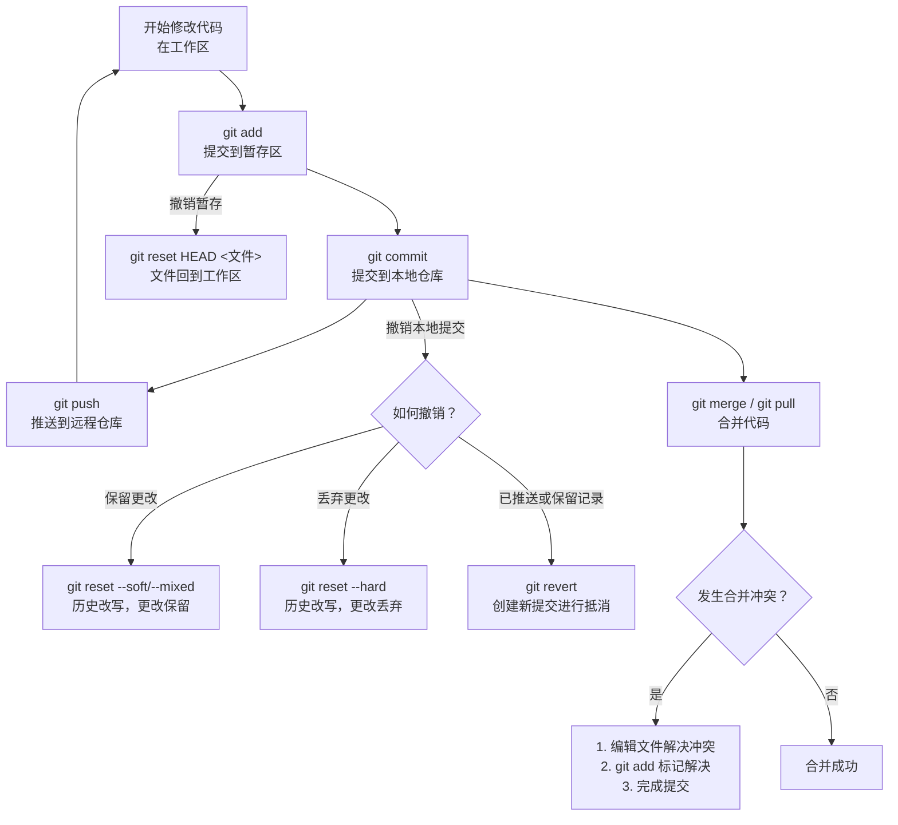

整理 Git 所有命令是一项庞大的工作，为了让你清晰掌握，我将其分为**日常工作流程**和**异常处理流程**两大部分，并整理了核心命令列表。

### 📁 一、Git 核心工作流程与命令
Git 的核心工作围绕 **工作区 → 暂存区 → 本地仓库 → 远程仓库** 这个流程展开。

**1. 初始设置与仓库克隆**
*   **全局配置**：设置用户名和邮箱，为提交记录署名。
    *   `git config --global user.name "你的名字"`
    *   `git config --global user.email "你的邮箱"`
*   **克隆现有仓库**：获取远程仓库的完整副本到本地。
    *   `git clone <仓库URL>`

**2. 日常开发循环 (修改 → 暂存 → 提交)**
这是你每天最常使用的命令序列。
*   **查看状态**：`git status`，查看文件处于工作区还是暂存区。
*   **添加更改到暂存区**：
    *   `git add <文件名>`：添加特定文件。
    *   `git add .`：添加所有**新文件和修改过的文件**。
    *   `git add -A`：添加所有变动，包括**修改、新建和删除的文件**。
*   **提交到本地仓库**：`git commit -m "提交说明"`，将暂存区内容永久记录。

**3. 分支操作**
分支是并行开发的关键。
*   **查看/创建/切换分支**：
    *   `git branch`：列出本地分支。
    *   `git checkout -b <新分支名>`：创建并切换到新分支。
    *   `git switch <分支名>`：切换到已有分支 (Git 2.23+ 新命令)。
*   **合并分支**：`git merge <分支名>`，将目标分支合并到当前分支。
*   **删除分支**：
    *   `git branch -d <分支名>`：删除已合并的分支。
    *   `git branch -D <分支名>`：强制删除未合并的分支。

**4. 与远程仓库同步**
*   **查看远程仓库**：`git remote -v`。
*   **拉取更新**：
    *   `git fetch`：仅下载远程最新内容，**不自动合并**。
    *   `git pull`：下载并**自动合并** (`git fetch` + `git merge`)。
*   **推送更新**：`git push origin <分支名>`，将本地提交推送到远程。

**5. 查看历史与对比**
*   **查看提交历史**：`git log`，使用 `--oneline` 或 `--graph` 查看简洁或图形化历史。
*   **比较差异**：
    *   `git diff`：比较**工作区**和**暂存区**的差异。
    *   `git diff --cached`：比较**暂存区**和**最新提交**的差异。

### 🚨 二、异常处理与撤销操作
当出现问题（如提交错误代码、合并冲突）时，可以使用以下命令。

**1. 撤销工作区的修改（未`git add`）**
*   **丢弃某个文件的修改**：`git checkout -- <文件名>`。
*   **丢弃所有未暂存的修改**：`git checkout -- .` (谨慎使用)。

**2. 撤销暂存区的修改（已`git add`，未`git commit`）**
*   **将文件移出暂存区**：`git reset HEAD <文件名>`，文件修改会保留在工作区。

**3. 撤销提交（已`git commit`）**
根据是否已推送（`git push`）和想如何处理修改，选择不同策略：

*   **场景A：仅撤销本地提交，且想重写提交历史**
    *   `git reset --soft HEAD~1`：撤销提交，但**保留**所有更改在暂存区。
    *   `git reset --mixed HEAD~1`：撤销提交，**保留**更改在工作区（默认选项）。
    *   `git reset --hard HEAD~1`：**彻底丢弃**提交和所有更改（危险！）。

*   **场景B：撤销已推送的提交，或希望保留撤销记录**
    *   `git revert <提交哈希值>`：创建一个**新的提交**来抵消指定提交的更改。这是最安全、最适合团队协作的方式。

**4. 处理合并冲突**
执行 `git merge` 或 `git pull` 时，如果不同分支修改了同一文件的同一区域，会产生冲突。
**解决流程**：
1.  Git 会在冲突文件中标记出冲突部分（`<<<<<<<`， `=======`， `>>>>>>>`）。
2.  手动编辑文件，选择要保留的代码，并**删除所有冲突标记**。
3.  使用 `git add <文件名>` 标记冲突已解决。
4.  完成合并：`git commit`。

**5. 临时保存工作现场**
当需要切换分支但不想提交未完成的工作时：
*   **保存**：`git stash`，将工作区和暂存区的修改压栈。
*   **恢复**：`git stash pop`，恢复并删除栈顶的存储。

### 💡 三、进阶与维护命令
这些命令用于优化仓库或处理复杂情况。
*   **交互式变基**：`git rebase -i`，用于合并、修改或重排提交历史，让历史更清晰。
*   **选择提交**：`git cherry-pick <提交哈希>`，将另一个分支的**特定提交**应用到当前分支。
*   **引用日志**：`git reflog`，查看所有分支头的操作记录，是**找回误删提交或分支的“救命稻草”**。
*   **仓库维护**：`git gc`，清理不必要的文件并优化本地仓库。

### 📝 四、核心流程图与速查表
为了帮你建立更直观的印象，下图概括了Git的核心工作流与主要异常处理路径：



最后，你可以通过以下命令快速回顾所有常用操作：
**基础操作**
*   `git init`：初始化新仓库。
*   `git clone <url>`：克隆仓库。
*   `git add <file>`：添加文件到暂存区。
*   `git commit -m "msg"`：提交更改。
*   `git status` / `git log`：查看状态/历史。

**分支与合并**
*   `git branch` / `git checkout -b `：查看/创建分支。
*   `git merge ` / `git rebase `：合并/变基分支。
*   `git push origin `：推送分支。

**撤销与恢复**
*   `git checkout -- `：丢弃工作区修改。
*   `git reset HEAD `：撤销暂存。
*   `git reset --hard `：彻底回退。
*   `git revert `：安全撤销提交。
*   `git stash`：暂存临时工作。

### 🔧 如何根据具体问题选择命令？
你可以根据遇到的具体场景来判断：
*   **代码改错了，想重来**：如果还没 `add`，用 `git checkout -- <file>`；如果已 `add` 但未 `commit`，用 `git reset HEAD <file>`。
*   **提交了错误信息或漏文件**：用 `git commit --amend` 修改最近一次提交。
*   **提交了错误代码到本地仓库**：用 `git reset HEAD~1` 回退，并根据需要加 `--soft`（保留更改）或 `--hard`（丢弃更改）。
*   **错误代码已推送到远程**：务必使用 `git revert` 创建反向提交，再 `push`。
*   **拉取代码时发生冲突**：按提示手动解决冲突文件，然后 `add` 并 `commit`。
*   **分支历史杂乱想整理**：考虑使用 `git rebase -i` 交互式变基。
*   **误删了分支或提交**：立即尝试 `git reflog` 查找记录并恢复。

如果你能告诉我你目前具体遇到了什么问题，或者在哪个工作环节感到困惑，我可以提供更具体的操作指导。

----
----

好的，这是一个非常实用的Git问题总结。我将为你清晰地介绍这三种情况的流程。

### 1. Git的正常工作流程（日常协作）

这是最常用、最标准的流程，用于将你的代码更改安全地保存并分享给他人。

**核心步骤：**

1.  **拉取更新**
    ```bash
    git pull origin <branch-name>
    ```
    *   **目的**：在开始工作前，先从远程仓库获取最新代码，避免与他人的修改冲突。这是一个好习惯。

2.  **进行修改**
    *   在工作目录中创建、修改或删除文件。

3.  **查看状态**
    ```bash
    git status
    ```
    *   **目的**：查看哪些文件被修改了，哪些文件是未跟踪的新文件。这是你做出下一步决定的依据。

4.  **添加文件到暂存区**
    ```bash
    # 添加特定文件
    git add <file1> <file2>
    # 添加所有变化（包括新文件和修改的文件，但不包括删除的文件）
    git add .
    # 添加所有变化（包括修改和删除的文件，但不包括新文件）
    git add -u
    ```
    *   **目的**：将文件的当前版本快照放入暂存区，准备下一次提交。

5.  **提交到本地仓库**
    ```bash
    git commit -m "描述这次提交的清晰、有意义的信息"
    ```
    *   **目的**：将暂存区的内容永久性地保存到本地Git仓库的历史记录中。

6.  **推送到远程仓库**
    ```bash
    git push origin <branch-name>
    ```
    *   **目的**：将你的本地提交上传到远程仓库（如GitHub, GitLab），与团队其他成员分享你的工作成果。

**流程图：**
`工作区` --(`git add`)--> `暂存区` --(`git commit`)--> `本地仓库` --(`git push`)--> `远程仓库`

---

### 2. 出现异常时的流程（解决冲突）

最常见的“异常”是**合并冲突**，发生在你`git pull`或`git merge`时，你和其他人修改了同一个文件的同一部分。

**解决流程：**

1.  **尝试拉取或合并**
    ```bash
    git pull origin main
    ```
    *   如果出现 `CONFLICT (content): Merge conflict in <file-name>` 的提示，说明冲突发生。

2.  **终止当前合并（可选）**
    *   如果你还没准备好解决冲突，可以中止合并，回到合并前的状态：
    ```bash
    git merge --abort
    ```

3.  **识别冲突文件**
    ```bash
    git status
    ```
    *   在 “Unmerged paths” 部分，Git会列出所有产生冲突的文件。

4.  **手动解决冲突**
    *   用编辑器打开冲突文件，你会看到类似这样的标记：
    ```html
    <<<<<<< HEAD
    这是你本地分支的修改
    =======
    这是远程分支（或他人）的修改
    >>>>>>> commit-hash-number
    ```
    *   **你的任务**：和团队成员沟通，决定保留哪一部分代码，或者将两部分代码整合。**删除冲突标记** `<<<<<<<`, `=======`, `>>>>>>>`。

5.  **标记冲突已解决**
    *   解决完所有冲突文件后，使用 `git add` 将每个解决后的文件标记为“已解决”：
    ```bash
    git add <resolved-file1> <resolved-file2>
    ```

6.  **完成合并**
    *   添加完所有解决后的文件，执行提交来完成合并过程：
    ```bash
    git commit -m "Merge branch 'main' and resolve conflicts"
    ```
    *   Git会为你预填一个合并提交信息，你可以直接使用或修改它。

7.  **推送结果**
    ```bash
    git push origin <your-branch-name>
    ```
    *   将解决冲突后的合并结果推送到远程仓库。

---

### 3. 想回退版本或回退修改的流程

根据回退的不同程度，有多种方法。

#### 场景A：回退未提交的本地修改（还未 `git commit`）

1.  **丢弃工作区的修改（危险操作，不可恢复！）**
    *   让指定文件回到最后一次 `git commit` 时的状态：
    ```bash
    git checkout -- <file-name>
    ```
    *   或者使用更语义化的新命令（Git 2.23+）：
    ```bash
    git restore <file-name>
    ```

2.  **从暂存区撤出文件（已 `git add`，但未 `git commit`）**
    *   将文件从暂存区移回工作区，但保留你的修改内容：
    ```bash
    git reset HEAD <file-name>
    ```
    *   或者使用新命令：
    ```bash
    git restore --staged <file-name>
    ```
    *   执行此操作后，文件修改仍在，但状态变成了“未暂存”，此时你可以再用 `git checkout -- <file>` 丢弃修改。

#### 场景B：回退已提交的版本（已 `git commit`）

1.  **软回退**
    *   **特点**：只移动`HEAD`指针，不改变工作区和暂存区的内容。相当于“撤销了提交，但修改内容还保留在暂存区”。
    *   **用途**：修改上一次的提交信息或合并多次提交。
    ```bash
    git reset --soft HEAD~1
    ```

2.  **混合回退（默认）**
    *   **特点**：移动`HEAD`指针，并且重置暂存区，但不改变工作区。相当于“撤销了提交和`git add`，但修改内容还保留在工作区”。
    *   **用途**：这是最常用的回退方式，重新整理提交。
    ```bash
    git reset --mixed HEAD~1
    # 或直接写 git reset HEAD~1
    ```

3.  **硬回退（危险操作，不可恢复！）**
    *   **特点**：移动`HEAD`指针，并且重置暂存区和工作区。**彻底丢弃指定提交之后的所有修改**。
    *   **用途**：完全放弃最近几次的提交。
    ```bash
    git reset --hard HEAD~1
    # 或回退到特定提交
    git reset --hard <commit-hash>
    ```
    *   **警告**：此操作会永久丢失工作区和提交，谨慎使用！

4.  **安全回退（用于公共分支）**
    *   **特点**：不修改历史，而是创建一个**新的提交**来抵消旧的提交。这是最安全的方法，尤其适用于已经推送到远程仓库的提交。
    *   **用途**：撤销某次特定的提交，而不影响历史记录。
    ```bash
    git revert <commit-hash>
    ```
    *   执行此命令后会打开编辑器让你填写回退的提交信息，保存即可。

**总结选择：**

| 场景 | 推荐命令 | 特点 |
| :--- | :--- | :--- |
| 丢弃未提交的修改 | `git restore <file>` | 危险，不可逆 |
| 撤销 `git add` | `git restore --staged <file>` | 安全，修改仍保留 |
| 撤销本地提交，想重新修改 | `git reset HEAD~1` (mixed) | 常用，修改保留在工作区 |
| 彻底放弃最近几次提交 | `git reset --hard <commit>` | **危险**，彻底删除 |
| 撤销已推送的提交 | `git revert <commit>` | **最安全**，不修改历史 |

希望这个清晰的梳理能帮助你更好地掌握Git！