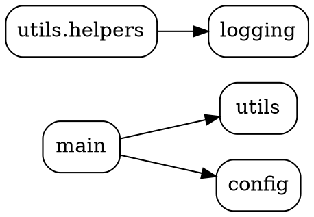

以下是一个Python脚本，用于生成指定目录中Python脚本文件之间的依赖关系（使用AST解析导入语句）：

```python
import os
import ast
import argparse
from collections import defaultdict

def find_py_files(directory):
    """查找目录中所有.py文件"""
    py_files = []
    for root, _, files in os.walk(directory):
        for file in files:
            if file.endswith('.py'):
                full_path = os.path.join(root, file)
                # 将路径标准化并转换为绝对路径
                py_files.append(os.path.normpath(full_path))
    return py_files

def path_to_module_name(file_path, root_dir):
    """将文件路径转换为模块名"""
    # 计算相对路径
    rel_path = os.path.relpath(file_path, root_dir)
    # 移除.py后缀
    if rel_path.endswith('.py'):
        rel_path = rel_path[:-3]
    # 处理__init__文件
    if rel_path.endswith('__init__'):
        rel_path = rel_path[:-8]
    # 替换路径分隔符为点
    module_name = rel_path.replace(os.sep, '.')
    # 移除开头的点
    if module_name.startswith('.'):
        module_name = module_name[1:]
    return module_name

def build_module_map(files, root_dir):
    """构建模块名到文件路径的映射"""
    return {path_to_module_name(f, root_dir): f for f in files}

def resolve_relative_import(current_module, import_level, module_name=None):
    """解析相对导入为绝对模块名"""
    parts = current_module.split('.')
    # 根据import级别计算基础模块
    base_level = len(parts) - import_level
    if base_level < 0:
        return None  # 无效的相对导入
    
    base_module = '.'.join(parts[:base_level]) if base_level > 0 else ''
    
    # 处理无模块名的导入 (from . import something)
    if module_name is None:
        return base_module
    
    # 组合绝对模块名
    return f"{base_module}.{module_name}" if base_module else module_name

def extract_imports(file_path, module_map, root_dir):
    """从文件中提取所有导入的模块名"""
    current_module = path_to_module_name(file_path, root_dir)
    dependencies = set()

    with open(file_path, 'r', encoding='utf-8') as f:
        try:
            tree = ast.parse(f.read(), filename=file_path)
        except (SyntaxError, UnicodeDecodeError):
            return dependencies  # 跳过无法解析的文件

    for node in ast.walk(tree):
        # 处理绝对导入: import x.y.z
        if isinstance(node, ast.Import):
            for alias in node.names:
                # 获取完整模块名
                full_name = alias.name.split('.')[0]  # 只取第一部分
                if full_name in module_map:
                    dependencies.add(full_name)
        
        # 处理from...import
        elif isinstance(node, ast.ImportFrom):
            # 处理相对导入
            if node.level > 0:
                abs_module = resolve_relative_import(
                    current_module,
                    node.level,
                    node.module
                )
            # 处理绝对导入
            else:
                abs_module = node.module
            
            if abs_module and abs_module in module_map:
                # 只添加主模块名
                main_module = abs_module.split('.')[0]
                dependencies.add(main_module)
    
    return dependencies

def generate_dependency_graph(directory):
    """生成依赖关系图"""
    # 查找所有Python文件
    all_files = find_py_files(directory)
    root_dir = os.path.abspath(directory)
    
    # 构建模块映射
    module_map = build_module_map(all_files, root_dir)
    
    # 收集依赖关系
    graph = defaultdict(set)
    for file_path in all_files:
        module_name = path_to_module_name(file_path, root_dir)
        imports = extract_imports(file_path, module_map, root_dir)
        graph[module_name] = imports
    
    return dict(graph)

def print_dot_graph(graph):
    """以DOT格式打印依赖关系图"""
    print("digraph Dependencies {")
    print('  rankdir="LR";')
    print('  node [shape=box, style="rounded"];')
    
    # 添加所有节点
    for module in graph.keys():
        print(f'  "{module}";')
    
    # 添加边
    for module, deps in graph.items():
        for dep in deps:
            print(f'  "{module}" -> "{dep}";')
    
    print("}")

if __name__ == "__main__":
    parser = argparse.ArgumentParser(description='生成Python脚本依赖关系图')
    parser.add_argument('directory', help='要分析的目录路径')
    parser.add_argument('--dot', action='store_true', help='输出DOT格式')
    args = parser.parse_args()

    graph = generate_dependency_graph(args.directory)
    
    if args.dot:
        print_dot_graph(graph)
    else:
        # 打印文本格式的依赖关系
        for module, deps in graph.items():
            if deps:
                print(f"{module} 依赖于:")
                for dep in deps:
                    print(f"  - {dep}")
            else:
                print(f"{module} 没有依赖")
```

### 使用说明：

1. 将脚本保存为 `dep_analyzer.py`
2. 通过命令行运行：
   ```bash
   python dep_analyzer.py /path/to/your/project
   ```
3. 添加 `--dot` 参数生成Graphviz格式的输出：
   ```bash
   python dep_analyzer.py /path/to/your/project --dot > dependencies.dot
   ```

### 功能说明：

1. **递归扫描目录**：查找所有.py文件（包括子目录）
2. **模块名转换**：
   - 将文件路径转换为模块名（例如 `src/utils/helper.py` → `utils.helper`）
   - 特殊处理 `__init__.py` 文件（视为包）
3. **依赖解析**：
   - 使用AST解析导入语句
   - 处理绝对导入 (`import module`)
   - 处理相对导入 (`from . import submodule`)
   - 处理from...import语句 (`from package import module`)
4. **输出格式**：
   - 默认输出文本格式的依赖关系
   - 使用 `--dot` 参数生成Graphviz兼容的DOT格式

### 示例输出：

文本格式：
```
main 依赖于:
  - utils
  - config
utils.helpers 依赖于:
  - logging
config 没有依赖
```

DOT格式：


### 可视化步骤：
1. 安装Graphviz：https://graphviz.org/download/
2. 生成图片：
   ```bash
   dot -Tpng dependencies.dot -o dependencies.png
   ```

### 注意事项：
- 仅分析项目内部的.py文件依赖（忽略标准库和第三方包）
- 处理相对导入时考虑导入层级（`.` 和 `..`）
- 跳过无法解析的文件（如包含语法错误）
- 自动处理包结构（`__init__.py` 文件）

此脚本能有效展示项目内Python脚本的依赖关系，帮助理解代码结构和优化模块设计。