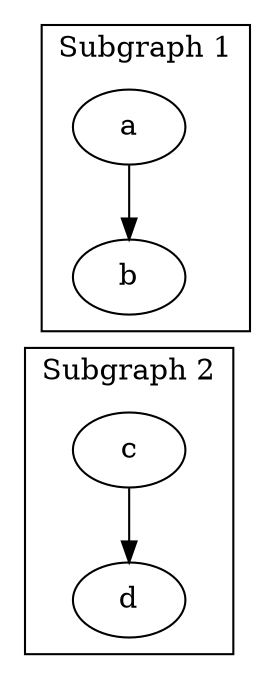
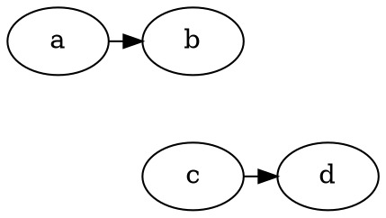

在 Graphviz 的 DOT 语言中，实现子图（subgraph）间的垂直排列可以通过以下两种核心方法实现：

### 方法 1：使用不可见边约束（推荐）


### 方法 2：显式分层（适用于简单场景）


---

### 关键技巧说明：
1. **`rankdir=TB`**  
   确保全局布局方向为 **从上到下**（Top to Bottom）

2. **不可见边 + 高权重**  
   ```dot
   b -> c [style=invis, weight=100];
   ```
   - `style=invis`：隐藏连线（不显示）
   - `weight=100`：强制布局引擎优先处理此约束（确保垂直顺序）

3. **簇边界约束（更精准）**  
   ```dot
   b -> c [ltail="cluster1", lhead="cluster2"];
   ```
   - 使用 `compound=true` 后，可直接连接子图边界
   - 避免子图内部节点意外影响布局

4. **显式分层**  
   ```dot
   { rank=same; a; b }  // 水平排列子图内节点
   { rank=same; c; d }  // 下一个垂直层
   ```
   适用于子图结构简单的场景

---

### 效果：
两种方法均会产生垂直排列的子图结构：
```
+---------------+
|   Subgraph 1  |
|  a ───▶ b     |
+---------------+
       ↓ (不可见约束)
+---------------+
|   Subgraph 2  |
|  c ───▶ d     |
+---------------+
```

> **提示**：若子图内部节点较多，建议使用方法1（带`ltail/lhead`的簇边界约束），可避免子图内部节点干扰垂直排列顺序。