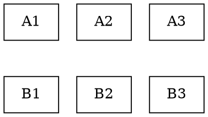

在 Graphviz 的 dot 语言中，实现**子图间垂直排列 + 子图内元素水平排列**需要结合 `rankdir`、`rank` 和不可见边（`style=invis`）。以下是完整解决方案：

### 核心思路：
1. **全局设置**：用 `rankdir=TB`（默认）确保整体垂直排列
2. **子图内水平排列**：用 `{rank=same; 节点列表}` 强制子图内节点同级
3. **子图间垂直排列**：用不可见边连接不同子图的锚点节点

### 示例代码：


### 关键技巧：
1. **水平排列**：
   ```dot
   { rank=same; A1; A2; A3; } // 节点声明必须在同一代码块
   A1 -> A2 -> A3 [style=invis]; // 维持水平顺序
   ```
   
2. **垂直连接**：
   ```dot
   edge [style=invis];
   // 连接锚点节点（如子图第一个节点）
   A1 -> B1; 
   ```

3. **子图边框**（可选）：
   ```dot
   subgraph cluster_X {
       label="Label";
       节点; 列表;
   }
   ```

### 效果说明：
| **层级** | **排列方向** | **元素**        |
|----------|--------------|-----------------|
| 子图间   | 垂直         | Subgraph 1 → Subgraph 2 |
| 子图内   | 水平         | A1 → A2 → A3            |

> **注意**：`cluster_` 前缀是子图边框的必要命名约定，纯排列可不加。

### 其他排列场景：
**子图间水平 + 子图内垂直**（交换方向）：
```dot
rankdir=LR; // 全局水平
// 子图内用 {rank=same} 实现垂直排列
```